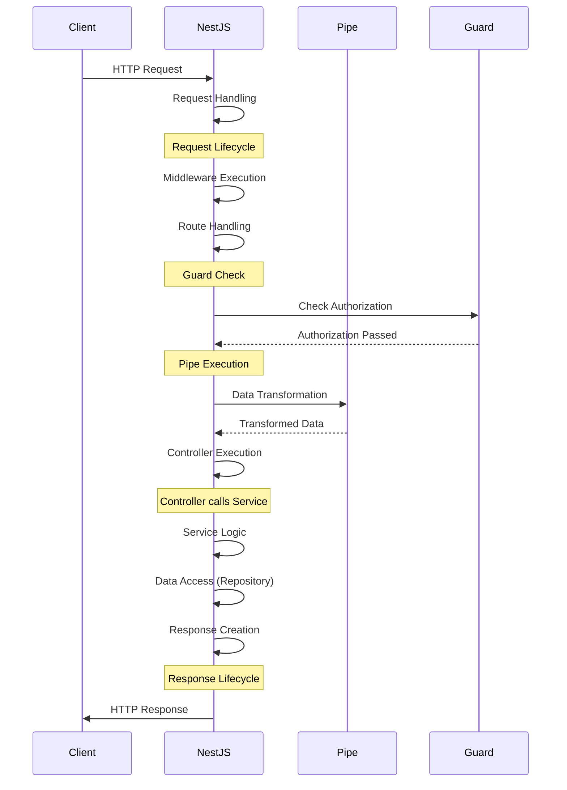

# NestJS 프로젝트 시작하기

터미널 환경에 명령어를 입력합니다.

### 폴더 생성하기
```sh
mkdir <폴더>
cd <해당 폴더>
```
### NPM 패키지 생성하기
npm 패키지 설치하기
```Bash
npm init -y 
```

### NestJS 의존성 패키지 설치하기
```Bash
npm install @nestjs/common@10.0.0 @nestjs/core@10.0.0 @nestjs/platform-express@10.0.0 reflect-metadata@0.1.13 typescript@5.1.3
```
Nest 라이브러리는 패키지로 나눠집니다.
```Bash
"@nestjs/common": "^10.0.0",
"@nestjs/core": "^10.0.0",
"@nestjs/platform-express": "^10.0.0",
"reflect-metadata": "^0.1.13",
"typescript": "^5.1.3"
```

- `@nestjs/common`는 Nest에 필요한 Class, Function 등 상당한 많은 기능을 가지고 있습니다.
- `@nestjs/platform-express` 기본값으로 Express.js를 사용하고 있습니다. Fastify로 대체가 가능합니다.
- `reflect-metadata`은 메타 정보를 담고 있는 데코레이터 라이브러리입니다.
- `typescript`은 타입스크립트를 사용합니다.

### `tsconfig.json` 파일에서 환경 설정하기
```json
{
  "compilerOptions": {
    "module": "commonjs",
    "target": "es2017",
    "experimentalDecorators": true,
    "emitDecoratorMetadata": true
  }
}
```
- `emitDecoratorMetadata`은 reflect-metadata를 활성화하는 설정입니다.
- `experimentalDecorators`은 데코레이터 지원을 실행하도록 활성화하는 설정입니다.

### Nest 서버 요청 응답 순서

HTTP 서버는 `Request` - `Response` 사이클로 이뤄집니다.
- 클라이언트가 `HTTP` 요청을 보냅니다.
- NestJS는 미들웨어를 실행하고, 라우팅 및 `Guard`를 확인합니다.
- `Guard`는 권한을 확인하고, 권한이 부여되면 계속 진행합니다.
- `Pipe`는 데이터 변환을 수행하고 변환된 데이터를 컨트롤러에 전달합니다.
- 컨트롤러에서는 서비스를 호출하며, 서비스는 필요한 비즈니스 로직을 수행합니다.
- 서비스는 데이터 액세스를 위해 리포지토리와 상호 작용합니다.
- `NestJS`는 응답을 생성하고 클라이언트에게 반환합니다.



# NestJS로 간단한 웹 서버 만들기
`src/main.ts` 파일을 생성합니다.
`Controller`, `Module`, `Get: @nestjs/common`에서 가져온 데코레이터는 컨트롤러와 경로를 정의하는 데 사용됩니다.
### 1. 컨트롤러 만들기
- `@Controller()`: 이 클래스를 HTTP 요청 처리를 담당하는 컨트롤러로 선언합니다.
```Typescript
import { Controller, Get } from '@nestjs/common';

@Controller()
export class AppController {
  @Get()
  getRootRoute() {
    return 'hi there!';
  }
}
```

### 2. 모듈 만들기
- `@Module()`: 이 클래스를 NestJS 애플리케이션의 기본 구성 요소인 모듈로 선언합니다.
- `controllers: [AppController]`: AppController를 모듈에 등록합니다.
```Typescript
import { Module, Controllers } from '@nestjs/common';
import { AppController } from './app.controller';

@Module({
  controllers: [AppController],
})
export class AppModule {}
```


### 3. 서버 시작하기
- `NestFactory.create(AppModule)`을 사용하여 NestJS 애플리케이션 인스턴스를 만듭니다.
- `app.listen(3000)`을 사용하여 애플리케이션 서버를 시작하고 포트 3000에서 들어오는 요청을 기다립니다.
```Typescript
import { NestFactory } from '@nestjs/core';
import { AppModule } from './app.module';

async function bootstrap() {
  const app = await NestFactory.create(AppModule);
  await app.listen(3000);
}

bootstrap();
```

### 4. 실행하기
- `npm run start` 명령을 사용하여 서버를 실행합니다.
- 웹 브라우저에서 http://localhost:3000 주소로 이동합니다.
- "hi there!" 메시지가 표시되는 것을 확인합니다.
