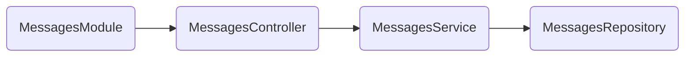

# Nest CLI 프로젝트

새 프로젝트를 설정하는 것은 Nest CLI를 사용하면 매우 간단합니다.   
npm을 설치한 상태에서 OS 터미널에서 다음 명령을 사용하여 새 Nest 프로젝트를 만들 수 있습니다

### CLI command reference
```Bash
npm i -g @nestjs/cli
nest new project-name
```
**nest generate**  
schematic에 따라 구성 된 파일을 생성합니다.
- schematic : 생성할 `schematic` 또는 `collection:schematic`입니다.
- name : 생성된 컴포넌트의 이름입니다.
```Bash
nest generate <schematic> <name> [options] 
```

```Bash
src
|-app.controller.spec.ts
|-app.controller.ts
|-app.module.ts
|-app.service.ts
|-main.ts
```

### Module 생성하기
모듈은 `@Module()` 데코레이터로 주석이 달린 클래스입니다.   
모듈 데코레이터는 Nest가 애플리케이션 구조를 구성하는 데 사용하는 **메타데이터**를 제공합니다.

```Bash
nest generate module messages
```

### Controller 생성하기
Controller는 수신 요청을 처리하고 클라이언트에 응답을 반환할 책임이 있습니다.
```Bash
nest generate controller messages/messages --flat
```
컨트롤러의 목적은 애플리케이션에 대한 특정 요청을 수신하는 것입니다. 라우팅 메커니즘은 어떤 컨트롤러가 어떤 요청을 수신할지 제어합니다. 각 컨트롤러에는 둘 이상의 경로가 있는 경우가 많으며, 서로 다른 경로가 서로 다른 작업을 수행할 수 있습니다.
```Typescript
import { Controller, Get, Post } from '@nestjs/common';

@Controller('messages')
export class MessagesController {
  @Get()
  listMessage() {
    return '';
  }

  @Post()
  createMessage() {
    return '';
  }

  @Get('/:id')
  getMessage() {
    return '';
  }
}
```